# Inspirationen

## MemCode.com
- Deck Overview 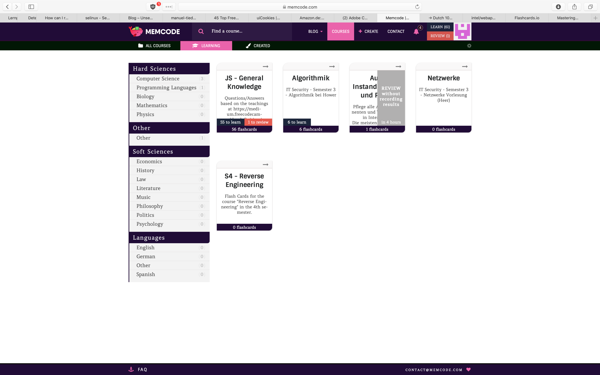
- Question View Empty Fields 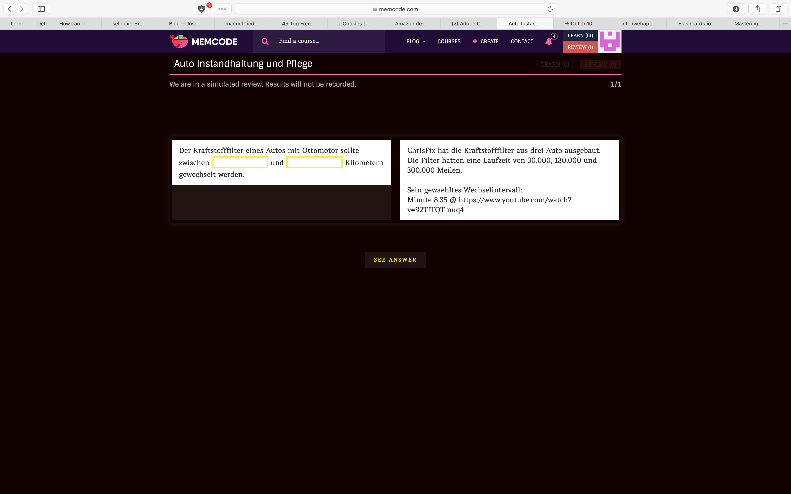
- Answer Submitted 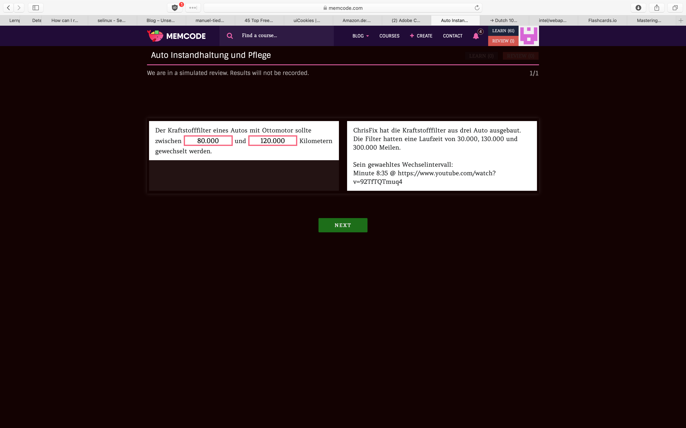
- Deck Learn View 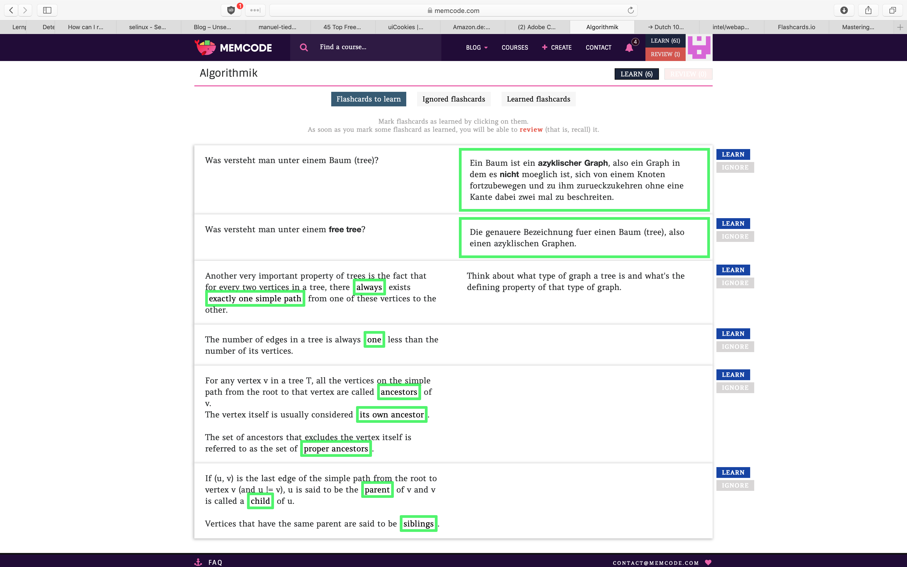
- Deck Overview after Review 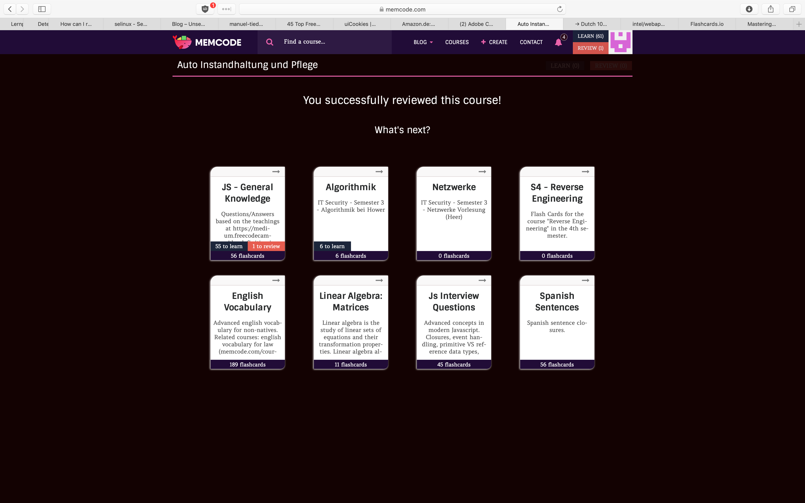

## AnkiWeb.net
- Start Page 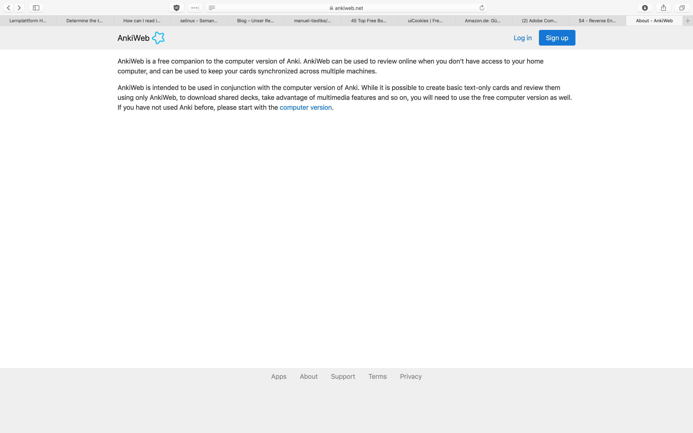
- Login Page 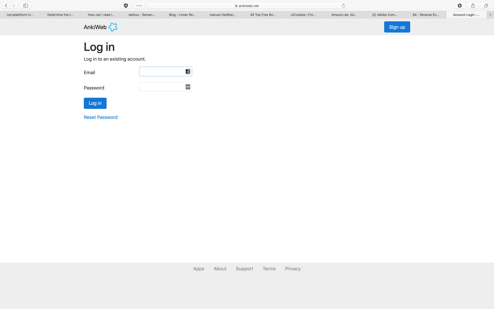
- Decks 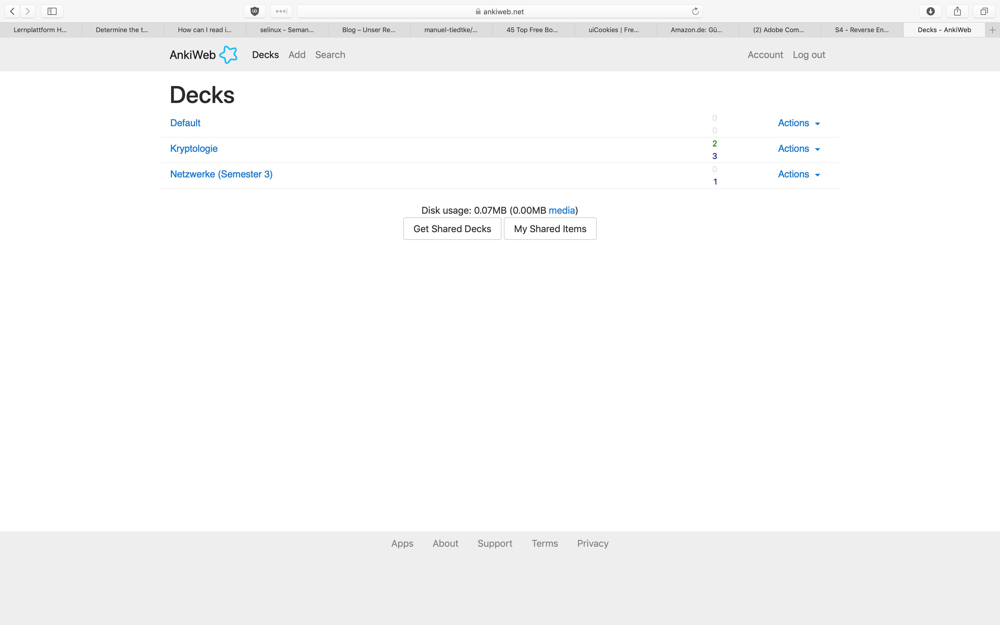
- Deck View 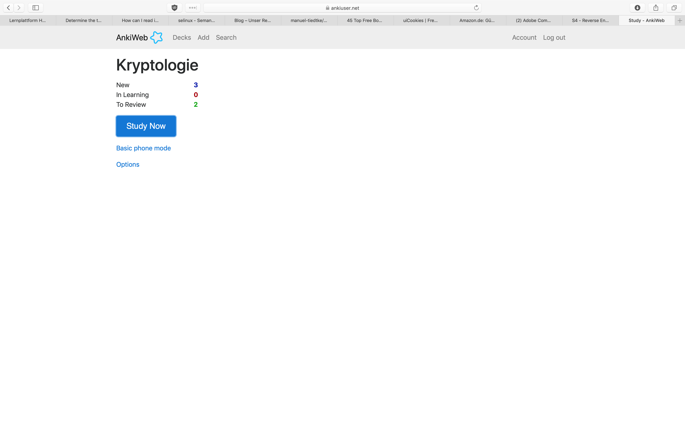
- Question 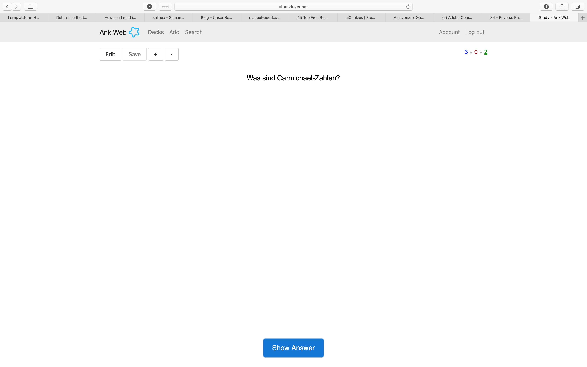
- Answer with Rating 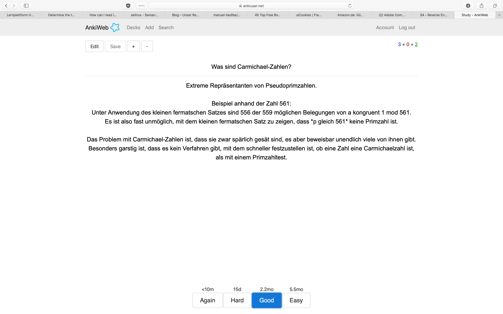
- Edit Card 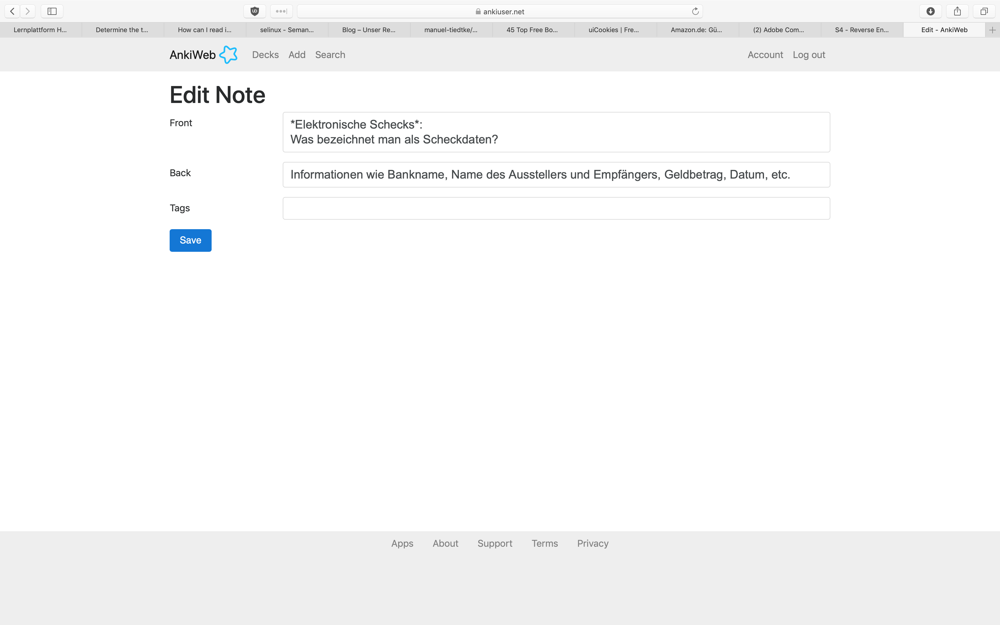

## Wokabulary
- [Wokabulary Video Overview](Videos/Wokabulary/Wokabulary_iOS_Overview.mp4)

## FlashCards.io
