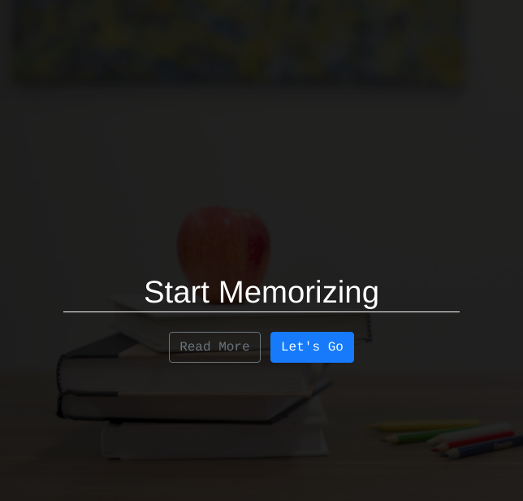
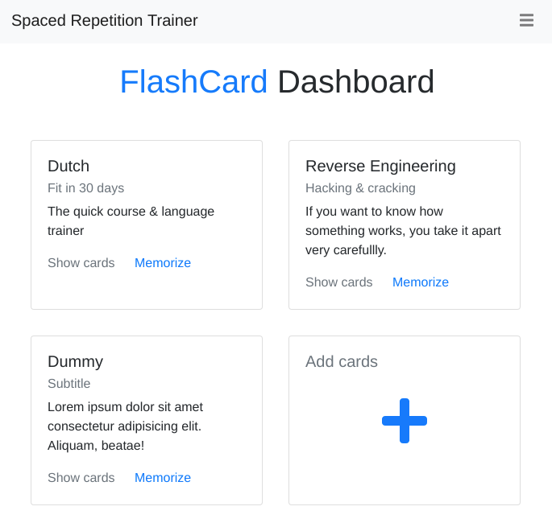
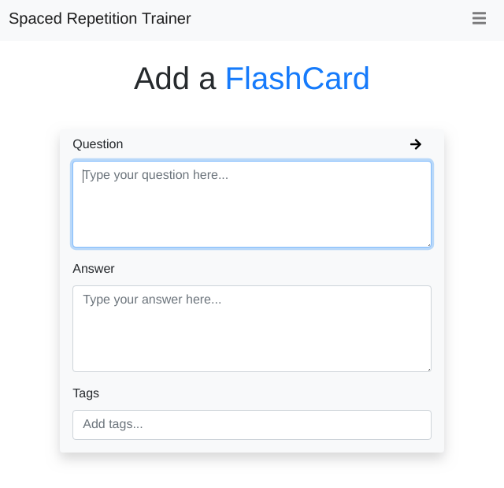
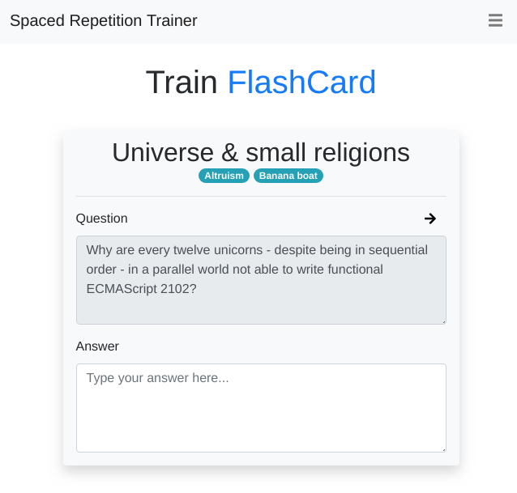

# FlashCard App
Max Kunzelmann, Manuel Tiedtke, Noah Ströhle

### Pitch \[English\]

> The project aims for optimizing the general learning process for the user. To achieve that, a `Spaced Repetition System` is developed. With this system the user can create question-answer pairs and gets the questions shown for review in regular intervals. She then will be able to check if she remembers the previously written down answer to the question. The intervals between the reviews are chosen in a way, that memorization is maximized with a minimal amount of repetitions. Timing is paramount for this and the app takes care to present the questions at the right time to the user.

### Geschäftsvorschlag \[Deutsch\]

> Ziel ist es den Lernprozess mit einer Webanwendung zu optimieren. Dazu wird ein `Spaced Repetition System` entworfen, auf Deutsch oft Karteikartensystem genannt. In diesem kann der Anwender Fragen-Anwort-Paare entwerfen und bekommt die Fragen in regelmäßigen Abständen vorgelegt und kann mit der Antwort prüfen, ob er das Gelernte noch erinnert. Die Abstände zwischen den Wiederholungen werden so gewählt, dass der Lernerfolg bei minimaler Wiederholungszahl maximal ist. Nach nur wenigen Wiederholungen wird das Gelernte ins Langzeitgedächtnis aufgenommen.

## Project management

### Team members

Max Kunzelmann \
Manuel Tiedtke \
Noah Ströhle

### Time Management

| Step | Description | Time Effort |
| ---- | ----------- | ----------: |
| 1. | **Pitch & Mockup** | Finished |
| 2. | **Static Prototype** | 2 weeks |
|| Create basic pages (start, dashboard, add, train) | Mostly finished |
|| Create other pages (login/register, profile/stats, ...) | 1 week |
|| Polish design | 2 day |
| 3. | **Dynamic Prototype** | 4 weeks |
|| Plan & create database | 2 days |
|| Setup Tomcat & Jersey | 1 day |
|| Implement basic REST API functionality | 1 week |
|| Integrate API into frontend | 1 week |
|| Polishing | 1 week |
| 4. | **Submission of finished product** | ? |
|| Final review by whole team | - |

### Work Distribution

> No final decision was made yet. Mostly work will be split by recognizing what has to be done and opening issues on GitHub. Assignment of the issues will most likely happen dynamically.

#### Rough areas of responsibility

- **Max Kunzelmann**
  - Front-end
- **Manuel Tiedtke**
  - Back-end
- **Noah Ströhle**
  - Database

## Mockup / Prototype

HTML click-dummy:
[**Prototype** on GitHub](https://github.com/manuel-tiedtke/M2N-Webanwendungen-2/tree/master/prototype)

### Start Page

> A hero image with a headline and two buttons. Below is a little "about" section with some informative text. This page will serve as a welcome page for new users.

### Dashboard Page

> The dashboard shows the user all available question categories, allows him to add new categories & questions, as well as making it possible to train on flashcards for a specific category. This page serves as the default start page for logged-in users.

### "Add a flash card" Page

> This page contains the ability to add new flashcards - each flashcard consists of a question, an answer and some tags used for grouping and searching. After the flashcard has been added to the system the `Spaced Repetition System` begins interrogating the user in regular intervals.

### "Train/Review a flashcard" Page

> This page is the main component of the `Spaced Repetition System`, as it presents the user with a flashcard for review. After answering the question the right answer will be shown to the user.

